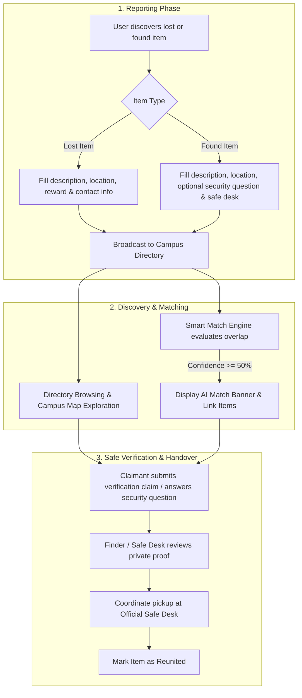

<div align="center">

# 🎓 UniFind
### *Campus Lost & Found Network*

A modern, fast, and secure lost-and-found platform built specifically for university campuses. Designed to help students, faculty, and campus staff quickly report, track, verify, and safely reunite lost belongings.

[](https://uni-find-c68axjr04-google-engineers.vercel.app)
[](https://react.dev/)
[](https://www.typescriptlang.org/)
[](https://vitejs.dev/)
[](https://tailwindcss.com/)
[](https://lucide.dev/)

**🔗 [Explore the Live Deployment](https://uni-find-c68axjr04-google-engineers.vercel.app)**

[🚀 Live Demo](https://uni-find-c68axjr04-google-engineers.vercel.app) • [Features](#-key-features) • [Getting Started](#-getting-started) • [How It Works](#-how-it-works) • [Campus Map & Safe Desks](#-campus-map--safe-desks) • [Project Structure](#-project-structure) • [Tech Stack](#-tech-stack)

</div>

---

## 📖 Overview

Losing essential personal items on a sprawling university campus—such as student ID cards, laptops, AirPods, keys, textbooks, or wallets—can cause immense stress and academic disruption.

**UniFind** streamlines campus lost-and-found operations with an intuitive, privacy-conscious, and community-driven directory. It features an automated **Smart Match Engine**, an **Interactive Campus Map**, and a **Challenge-Based Verification System** to ensure items are safely returned to their verified owners.

---

## ✨ Key Features

### 🔍 Real-Time Search & Multi-Faceted Filtering
* **Instant Full-Text Search**: Search across item titles, descriptions, distinguishing marks, locations, and tags simultaneously.
* **Granular Filter Controls**:
  * **Status & Type**: View all, active lost items, found items awaiting claim, or reunited items.
  * **8 Specialized Categories**: ID & Cards, Electronics & Audio, Books & Notes, Bottles & Drinkware, Keys & Wallets, Bags & Backpacks, Clothing & Wearables, and Other.
  * **Campus Zones & Buildings**: Filter by specific campus buildings (e.g., Central Library, Student Center, Science Labs, Engineering Hall, Recreation Complex).
  * **Time Range**: Filter by items reported today, within 3 days, this week, or this month.
* **Flexible Layout**: Toggle between high-density **Grid View** and compact **List View**.

### 🤖 Intelligent Smart Match Engine
* Automatic heuristic cross-matching between newly reported lost items and discovered found items.
* Evaluates confidence scores (0–100%) based on:
  * Category match (+40 pts)
  * Location proximity / same building (+30 pts)
  * Tokenized keyword & feature overlap (+12 pts per common token)
  * Date & time correlation (+10 pts)
* Highlights top matching pairs directly on the homepage with confidence breakdowns and quick-review actions.

### 🗺️ Interactive Campus Map & Hotspot Inspector
* Vectorized campus board visualizing key campus zones (*North, Central, South, East, West*).
* Live building status pins displaying real-time counts of lost and found items.
* Highlights designated **Campus Safe Handover Desks** with exact office details and operating hours.

### 🛡️ Secure Verification & Claim Workflow
* **Security Questions**: Finders can attach challenge questions (e.g., *"What sticker is on the laptop lid?"* or *"What initials are inscribed inside?"*) to prevent fraudulent claims.
* **Private Ownership Proof**: Claimants provide private verification details (lockscreen wallpapers, serial numbers, unique scratches) visible only to staff and finders.
* **Scheduled Handover**: Coordinate safe pickups at official campus desks or public daylight spots.

### 🎨 Modern, Accessible & Delightful UX
* **Light / Dark Mode**: Seamless dark mode support with automatic system preference detection and `localStorage` persistence.
* **Glassmorphism & Micro-animations**: Modern aesthetic powered by Tailwind CSS v4, Plus Jakarta Sans typography, and smooth modal transitions.
* **Celebration Confetti**: Instant confetti animations upon posting reports or successfully marking items as reunited.
* **Responsive Design**: Flawlessly optimized across mobile devices, tablets, and desktop displays.

---

## 🚀 Getting Started

### Prerequisites
Make sure you have the following installed on your machine:
* [Node.js](https://nodejs.org/) (`v18.0.0` or higher recommended)
* [pnpm](https://pnpm.io/) (or `npm` / `yarn`)

### Installation

1. **Clone the repository:**
   ```bash
   git clone https://github.com/kelvinbkenn/UniFind.git
   cd UniFind
   ```

2. **Install dependencies:**
   ```bash
   # Using pnpm (recommended)
   pnpm install

   # Or using npm
   npm install
   ```

3. **Start the development server:**
   ```bash
   pnpm run dev
   # Or: npm run dev
   ```

4. **Open in browser:**
   Navigate to [[http://localhost:5173](https://uni-find-c68axjr04-google-engineers.vercel.app/)]([http://localhost:5173](https://uni-find-c68axjr04-google-engineers.vercel.app/)) in your browser.

---

## 🛠️ Build & Deployment

To generate an optimized production build:

```bash
# Type check and build with Vite
pnpm run build

# Preview the production build locally
pnpm run preview
```

---

## 🔄 How It Works



---

## 🏢 Campus Map & Safe Desks

UniFind encourages safe handovers at official university information and security desks:

| Campus Location | Zone | Safe Desk | Hours |
| :--- | :--- | :--- | :--- |
| **W.E.B. Central Library** | Central | Library Main Circulation Desk (1st Floor) | 8:00 AM – 10:00 PM |
| **Student Center & Food Court** | Central | Student Union Info Booth (Ground Floor) | 8:00 AM – 10:00 PM |
| **Science & Chemistry Complex** | North | Dean of Science Reception (Room 102) | 8:30 AM – 5:00 PM |
| **Engineering & Tech Building** | East | Engineering Student Services (ENG 201) | 8:30 AM – 5:00 PM |
| **North Recreation Complex** | North | Gym Front Member Services Desk | 6:00 AM – 11:00 PM |
| **Transit Hub & Bus Terminal** | South | Campus Security Station (Transit Office) | **24/7 Available** |

> [!IMPORTANT]
> **High-Value Items & Government IDs**: Found Passports, government ID cards, credit cards, or large amounts of cash should be deposited immediately with the **Campus Police & Transit Office** (Hotline: `(555) 911-0022`).

---

## 📂 Project Structure

```
UniFind/
├── index.html                 # Main HTML entrypoint with font presets
├── package.json               # Scripts and dependencies
├── pnpm-lock.yaml             # Lockfile
├── tsconfig.json              # TypeScript configuration
├── vite.config.ts             # Vite build and Tailwind plugin configuration
└── src/
    ├── main.tsx               # Application bootstrap
    ├── App.tsx                # Main container, filter orchestration & modal state
    ├── index.css              # Global styling, Tailwind imports, scrollbar tokens
    ├── types/
    │   └── index.ts           # Type definitions (Item, Claim, Location, FilterState)
    ├── data/
    │   └── mockData.ts        # Campus locations, category configs, initial mock dataset
    ├── utils/
    │   └── helpers.ts         # Smart match heuristic algorithm & time formatting
    └── components/
        ├── Navbar.tsx                 # Header navigation, search, stats, theme toggle
        ├── StatsBanner.tsx            # Quick action hero banner & category shortcuts
        ├── SmartMatchBanner.tsx       # AI heuristic matching alert banner
        ├── FilterBar.tsx              # Filters, sorting, search, grid/list toggles
        ├── ItemCard.tsx               # Individual item card (grid and list layouts)
        ├── ItemDetailModal.tsx        # Comprehensive item inspection modal
        ├── PostItemModal.tsx          # Multi-step item reporting modal
        ├── ClaimModal.tsx             # Ownership verification & claim submission modal
        ├── ContactModal.tsx           # Private message composer modal
        ├── CampusMapModal.tsx         # Interactive campus vector map with zone filtering
        ├── SafeHandoverGuideModal.tsx # Safe exchange protocol & security guidelines
        ├── CategoryIcon.tsx           # Dynamic category Lucide icon mapper
        └── Toast.tsx                  # Toast notification stack
```

---

## 💻 Tech Stack

| Layer | Technology | Description |
| :--- | :--- | :--- |
| **Frontend Framework** | [React 19](https://react.dev/) | Component architecture with hooks (`useState`, `useMemo`, `useEffect`) |
| **Language** | [TypeScript 5.7](https://www.typescriptlang.org/) | Strict type safety for data models and state management |
| **Styling** | [Tailwind CSS v4](https://tailwindcss.com/) | Next-generation utility-first styling with `@tailwindcss/vite` |
| **Build Tool** | [Vite 6.2](https://vitejs.dev/) | Ultra-fast HMR and optimized production bundling |
| **Icons** | [Lucide React](https://lucide.dev/) | Clean, consistent SVG icons |
| **Visual Effects** | [Canvas Confetti](https://www.npmjs.com/package/canvas-confetti) | Interactive celebratory particle effects |
| **Typography** | Plus Jakarta Sans & JetBrains Mono | Modern, legible typography pairing |
| **Data Persistence** | `localStorage` API | Seamless client-side state persistence with fallback data |

---

## 🤝 Contributing

Contributions are welcome! If you have suggestions or want to add features (such as backend API integration, push notifications, or QR code badge generation):

1. Fork the Project
2. Create your Feature Branch (`git checkout -b feature/AmazingFeature`)
3. Commit your Changes (`git commit -m 'Add some AmazingFeature'`)
4. Push to the Branch (`git push origin feature/AmazingFeature`)
5. Open a Pull Request

---

## 📄 License

Distributed under the **MIT License**. See `LICENSE` for more information.

---

<div align="center">
  <sub>Built with ❤️ for university students, faculty, and campus communities.</sub>
</div>
